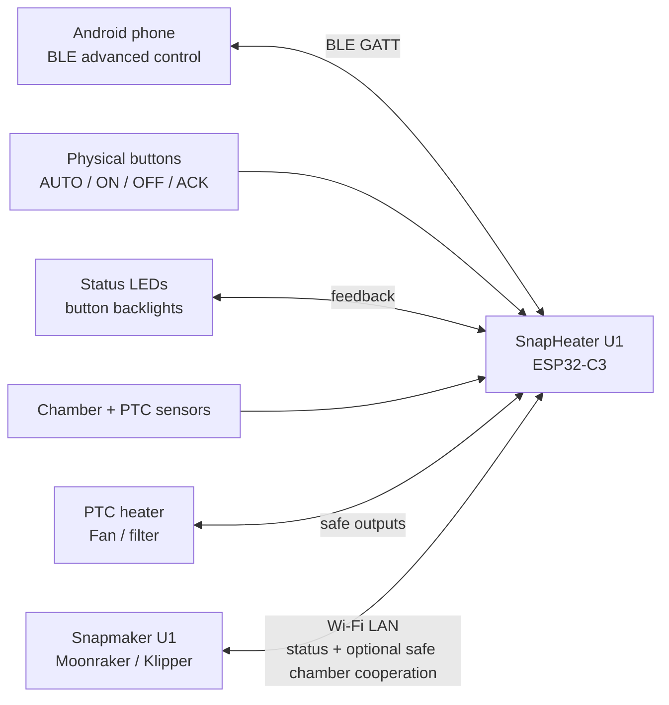

# SnapHeater U1

[](LICENSE)
[](#build-target)
[](#current-stage)
[](https://buymeacoffee.com/damianborkh)

**Smart chamber-heater firmware skeleton for Panda Breath-style ESP32-C3 hardware, designed for Snapmaker U1.**

SnapHeater U1 is a from-scratch firmware architecture for turning a chamber-heater accessory into a printer-aware chamber climate companion for **Snapmaker U1**. It combines Moonraker-based printer awareness, BLE control, physical buttons, safety layers, thermal intelligence, post-print conditioning and presentation-ready documentation.

> Current status: **advanced firmware skeleton / architecture base**.
> The project builds for ESP32-C3 with ESP-IDF v5.3.5 and is prepared for later bring-up, GPIO validation and Android application development.

---

## Support

SnapHeater U1 is released under the MIT License and is developed as an open project.
If this work helps you or you want to support continued firmware, documentation and hardware-validation work, you can support the project here:

[Buy Me a Coffee](https://buymeacoffee.com/damianborkh)


---

## Why this project exists

A chamber heater becomes much more useful when it understands the printer. SnapHeater U1 is designed to coordinate chamber temperature with printer state, selected material, print progress, pause/finish behavior and user preferences.

The project is not intended to take over the printer. It focuses on safe chamber climate cooperation.

---

## Key features

See [PROJECT_HIGHLIGHTS.md](PROJECT_HIGHLIGHTS.md) for the full feature list.

Main highlights:

- **Snapmaker U1 / Moonraker integration**
- **U1 Symbiont Mode** for safe chamber-related cooperation
- **BLE advanced control** for Android/mobile workflows
- **Physical quick controls** with buttons and status LED/backlight support
- **Preheat / Hold**, **Heat Soak**, **Chamber Stability Lock**
- **Tempering** with user-selected duration
- **Post-Print Conditioning** and **Pickup Mode**
- **Material-aware profiles**, mismatch warning and PLA protection
- **Anti-Warp**, **Large Print Protection**, **Safe Overnight Mode**
- **Virtual Door / Open Lid Detection** through temperature-drop analysis
- **Heater Health Test**, **Airflow Detection**, **Filter Life Counter**
- **Energy Estimate**, **Temperature History**, **Incident Report**
- **First Setup Wizard**, **Output Safety Latch**, **Safety Score**
- **Local-only operation**, event codes and notification levels
- **Demo / Showcase Mode** for presentation and testing

---

## System architecture



Additional diagrams: [docs/SYSTEM_DIAGRAMS.md](docs/SYSTEM_DIAGRAMS.md)

---

## Control model

SnapHeater U1 uses two user-control layers:

### Physical quick controls

Basic local actions that should work without a phone:

- **AUTO** — printer-aware chamber mode
- **ON** — manual chamber hold / preheat shortcut
- **OFF** — stop / safe stop / emergency off
- **ACK** — acknowledge local warnings or events
- **LED/backlight feedback** — mode, connectivity and fault status

### BLE / Android advanced control

Advanced configuration and smart workflows:

- material profile selection,
- preheat target and hold time,
- heat soak and chamber readiness,
- tempering duration,
- drying modes,
- Symbiont Mode settings,
- safety validation,
- diagnostics, events and reports.

---

## U1 Symbiont Mode

**U1 Symbiont Mode** is the biologically inspired cooperation model between SnapHeater U1 and Snapmaker U1.

In this mode SnapHeater U1 can:

- read printer state from Moonraker,
- adapt chamber behavior to material and print state,
- optionally cooperate with chamber-related ventilation behavior,
- keep printer-critical actions blocked by design.

Blocked by design:

- print cancel/pause commands,
- motion commands,
- extrusion commands,
- nozzle and bed temperature changes,
- other printer-critical functions.

The goal is chamber climate cooperation, not full printer control.

---

## Safety philosophy

The firmware skeleton includes a staged safety model:

- heater output disabled by default,
- board pin mapping isolated in `main/board_panda_breath.h`,
- output safety latch,
- sensor fault handling,
- PTC overtemperature protection,
- session timeout,
- incident report/fault snapshot,
- first setup validation,
- GPIO probe and staged hardware bring-up.

> Physical heater output should remain locked until the PCB pin mapping, output polarity, fan behavior and sensor readings are confirmed on real hardware.

---

## Repository structure

```text
SnapHeater_U1/
├── README.md
├── PROJECT_HIGHLIGHTS.md
├── FEATURE_MATRIX.md
├── BUILD_AND_TEST_PLAN.md
├── CHANGELOG.md
├── docs/
│   └── SYSTEM_DIAGRAMS.md
├── examples/
├── main/
│   └── board_panda_breath.h
├── CMakeLists.txt
├── partitions.csv
└── sdkconfig.defaults
```

Useful starting points:

- [PROJECT_HIGHLIGHTS.md](PROJECT_HIGHLIGHTS.md) — public feature overview
- [FEATURE_MATRIX.md](FEATURE_MATRIX.md) — feature readiness and test status
- [BUILD_AND_TEST_PLAN.md](BUILD_AND_TEST_PLAN.md) — safe build and bring-up sequence
- [docs/HARDWARE_BRINGUP_CHECKLIST.md](docs/HARDWARE_BRINGUP_CHECKLIST.md) — first physical hardware bring-up checklist
- [docs/SAFETY_UNLOCK_PROCEDURE.md](docs/SAFETY_UNLOCK_PROCEDURE.md) — staged criteria for unlocking probe and heater output features
- [docs/SYSTEM_DIAGRAMS.md](docs/SYSTEM_DIAGRAMS.md) — Mermaid diagrams
- [main/board_panda_breath.h](main/board_panda_breath.h) — central board pin configuration

---

## Build target

Target platform:

```text
ESP32-C3
ESP-IDF
```

Initial build command:

```bash
idf.py set-target esp32c3
idf.py build
```

Current build baseline:

- target: `esp32c3`
- ESP-IDF: `v5.3.5`
- flash layout: Panda Breath-style `4MB` dual-OTA partition table
- default safety: `CONFIG_SHU1_ENABLE_HEATER_OUTPUT=n`

The first hardware flash should be performed with physical heater output disabled.

---


## License, attribution and project origin

SnapHeater U1 is licensed under the **MIT License**.

Original project by **Damian Borkowski** (`@damianborkowski88`).

For license and attribution details, see:

- [LICENSE](LICENSE)
- [LICENSE_POLICY.md](LICENSE_POLICY.md)
- [AUTHORS.md](AUTHORS.md)
- [NOTICE.md](NOTICE.md)
- [PROJECT_ORIGIN.md](PROJECT_ORIGIN.md)
- [BRANDING_AND_ATTRIBUTION.md](BRANDING_AND_ATTRIBUTION.md)

The project is intended as the original upstream SnapHeater U1 firmware framework for Snapmaker U1-focused chamber-heater development. Forks and derivative works are welcome under MIT, but should preserve copyright/license notices and clearly credit the original upstream project.


## Current stage

This repository currently contains a **feature-rich firmware skeleton**. It is intended as the base for:

1. safe firmware flashing with heater output locked,
2. GPIO and sensor validation,
3. Moonraker/Snapmaker U1 integration tests,
4. BLE/mobile integration,
5. staged heater/fan bring-up.

It is not yet a fully validated production firmware.

For the first physical hardware session, follow [docs/HARDWARE_BRINGUP_CHECKLIST.md](docs/HARDWARE_BRINGUP_CHECKLIST.md).

---

## License

SnapHeater U1 is released under the **MIT License**.

See:

- [LICENSE](LICENSE) — full license text
- [LICENSE_POLICY.md](LICENSE_POLICY.md) — project licensing scope and rationale
- [THIRD_PARTY_NOTICES.md](THIRD_PARTY_NOTICES.md) — external ecosystem and dependency notes
- [SECURITY.md](SECURITY.md) — safety and security policy


## Hardware flash layout

SnapHeater U1 now uses a Panda Breath-compatible 4 MB flash layout with two large OTA app slots, SPIFFS, coredump and NVS. See [`docs/original_flash_layout.md`](docs/original_flash_layout.md).


## Development safety and original flash notes

Before flashing hardware, make a full backup of the original device flash. See [`docs/FLASH_BACKUP_RESTORE.md`](docs/FLASH_BACKUP_RESTORE.md). Clean-room binary findings are summarized in [`docs/BINARY_FINDINGS_NOTES.md`](docs/BINARY_FINDINGS_NOTES.md).
