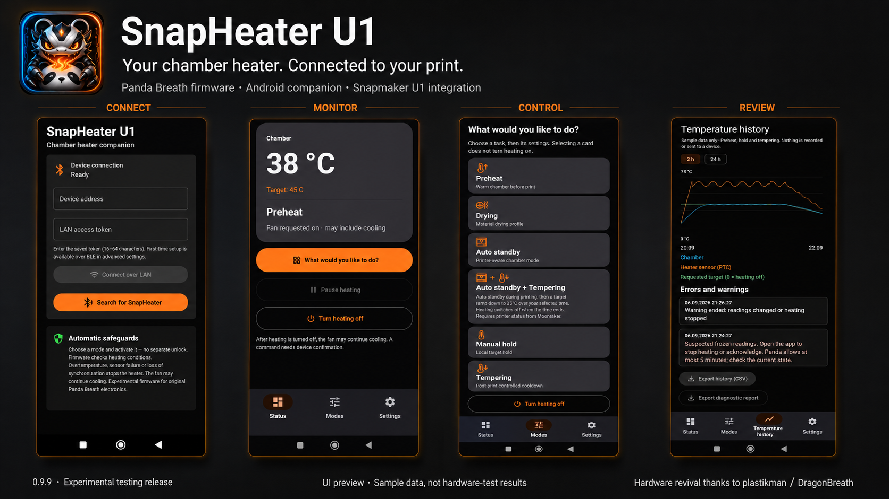

<h1 align="center">SnapHeater U1</h1>

<strong>Your chamber heater. Connected to your print.</strong>

Open firmware for original Panda Breath electronics • Android companion • Snapmaker U1 integration

> **TESTING RELEASE — NOT STABLE.** Heater and fan support are enabled.
> Test at your own risk, continuously supervise operation and report abnormalities.
> This software is provided without warranty; authors and contributors disclaim
> liability to the extent permitted by applicable law. This notice does not make
> the device safe. Read the [testing and risk notice](docs/HARDWARE_LIABILITY_DISCLAIMER.md)
> and [known limitations](docs/SAFETY_STATUS.md) before installing.

[Download 0.9.9](https://github.com/AlphaStudioDE/SnapHeater-U1/releases/tag/v0.9.9) ·
[Install / OTA guide](docs/INSTALL_0.9.9.md) ·
[Polski](docs/README_PL.md) ·
[Feature status](FEATURE_MATRIX.md) ·
[Report a problem](https://github.com/AlphaStudioDE/SnapHeater-U1/issues/new/choose)

## More than a temperature setting

  

**Connect → monitor → choose a task → review history.**
[Open the screenshot gallery](docs/GALLERY.md).
This overview uses interface screenshots, not evidence of a live heater test. Dashboard
readings and History data are illustrative. Earlier dashboard/mode captures
predate the History navigation fix; the current app includes that tab.
The public APK has no preview option.

SnapHeater connects chamber heating to the way you actually use a Snapmaker U1:
prepare the chamber, start a print, maintain your selected conditions and
optionally finish with a controlled temperature ramp. Your phone is the control
panel — **Panda executes the accepted job itself**, including printer monitoring,
even after the phone disconnects.

The value is a coordinated workflow on existing hardware, not a promise of
higher temperatures or more heater power. This testing release caps the target
at **55 °C**; reaching that target depends on the enclosure and environment.

## A phone app built around tasks

- **Preheat and hold** — prepare the chamber before printing.
- **Auto standby** — printer-aware heating using Panda's own Moonraker connection.
- **Auto standby + Tempering** — continue into a timed ramp after print completion,
  from the selected AUTO target toward 35 °C.
- **Manual hold, filament drying and standalone tempering** — independent of printer status.
- **Pause heating** — cut heat while retaining the task; **Stop** cancels it.
- **A guided connection wizard** — heater first, Wi-Fi next, then printer setup.
  Skip the printer step and printer-dependent modes remain unavailable.
- **Multiple saved heaters** — short device-derived names and editable display names.
- **A separate History tab** — temperature charts, timestamped events, CSV and
  diagnostic report export. Panda buffers up to 120 minutes at 10-second intervals
  to fill recoverable gaps after reconnection.

Android uses BLE and authenticated LAN REST. OTA uses LAN REST, not BLE.
The companion APK is a sideloadable **debug/testing build**, not a Play Store release.
The public APK has **no disconnected-device preview option**. Screenshot preview
is available only in an explicitly opted-in local developer build, not release assets.
English, Polish and German resources are included. iOS is not shipped.

## Integration that lives on Panda

Panda connects directly to the U1 through Moonraker. Printer discovery is assisted
by the phone during setup; the phone does not need to remain connected during a job.
No printer-side package or custom macro installation is required by SnapHeater.

Choose normal printer-managed ventilation or **Symbiont**:
SnapHeater supervises supported chamber exhaust and, where fitted/detected, top-cover
ventilation. Ventilation starts above target +5 °C, reaches 100% at +7 °C, and
reduces as the chamber approaches target, with hysteresis.
This does **not** control toolhead/model cooling fans. Network latency prevents
instantaneous enforcement; loss of ventilation control does not itself stop the
accepted heating job. Local thermal safeguards remain authoritative.
See [the exact curve and limits](docs/SYMBIONT.md).

## Visibility, even when something goes wrong

Virtual-door warnings flag abrupt temperature drops in every mode.
Sensor, overtemperature and zero-cross faults are handled locally, not by waiting
for a phone notification. Suspected frozen-but-plausible readings use a separate
advisory and five-minute response window; this heuristic is not a universal sensor-fault detector.
Notifications are best effort, never a substitute for supervision.

Usage counters are stored on Panda: heater time counts applied SSR-on time at
a valid chamber reading of at least 35 °C; filter time counts fan-on time.
These are runtime estimates, not measured wear. Sudden power loss can lose
uncheckpointed time. [Details and limitations](docs/CURRENT_IMPLEMENTATION.md).

## What changes compared with using the stock workflow?

SnapHeater offers its own Android BLE/REST interface, multi-heater organization,
U1-aware jobs, post-print ramping, history catch-up and optional ventilation
supervision as one open, inspectable system. It replaces the Panda application
firmware — it does not add a bridge board or require a replacement PCB.

We do not claim that every stock firmware version lacks every listed function,
or that SnapHeater has proven better print quality, lower energy use, higher
reliability or safer electronics. Those outcomes require comparative device tests.

## Safety is a control boundary, not a checkbox

Normal activation does not require a separate manual arming ritual. Boot alone
does not request heat. Fault recovery never automatically resumes a stopped job.

The firmware includes sensor checks, a 55 °C target ceiling, 85 °C chamber /
105 °C PTC hard trips, board-dependent foldback, zero-cross-loss latching,
priority OFF, watchdog checks and inactive-slot OTA validation including SHA-256.
The Panda fan uses a held gate, not PWM/phase-angle experiments.
A valid command and ZC signal do **not** prove actual fan rotation or airflow.

Offline tests and builds pass; electrical waveforms, installed bootloader recovery,
radio behavior and real U1/top-cover combinations still require supervised
hardware qualification. **Do not operate this prerelease unattended.**
[Safety status](docs/SAFETY_STATUS.md) · [Testing guide](docs/TESTING.md).

## Built on community discoveries

**This project was revived thanks to the work of
[plastikman, author of DragonBreath](https://github.com/plastikman/DragonBreath).**
The published Panda Breath hardware map, fan/TRIAC behavior, NTC conversion and
thermal findings made this recovery possible.

SnapHeater remains an independent project with its own Android and U1 workflows.
Attribution does not imply DragonBreath's endorsement or transfer its hardware
qualification to this firmware. [Acknowledgements](ACKNOWLEDGEMENTS.md) ·
[Third-party notices](THIRD_PARTY_NOTICES.md).

## Why help develop SnapHeater?

Existing heater hardware can become a more transparent, printer-aware accessory.
Open code lets the community inspect behavior, reproduce problems, improve the
interface and contribute measured results instead of relying on a closed black box.

The next valuable contributions are supervised test reports, real-device screenshots,
translations and reproducible bug fixes — not bypassing safety checks.
Read the [project story and Innovation Fund brief](docs/PROJECT_STORY.md).
This is an independent community project, not an official Snapmaker or BIGTREETECH product.

[Contribute](CONTRIBUTING.md) · [Gallery](docs/GALLERY.md).

## Source and builds

Firmware: ESP32-C3, ESP-IDF **5.3.5**, WebSocket client **1.7.0**, original Panda
Breath V1.0/V1.0.1 layout. **Not AirGuard 300, not a generic DIY firmware image.**

See [build instructions](docs/TESTER_BUILD.md), [build provenance](docs/BUILD_PROVENANCE.md),
[API](docs/api.md), [BLE](docs/ble_android.md) and [Android source](apps/android/SnapHeaterU1).

Version 0.9.9 is the first packaged testing release in the new public numbering.
Older 1.x development labels are historical, not newer stable releases.

Original project: **Damian Borkowski**. [MIT License](LICENSE).

## Support development

If you find this project useful, you can support continued development, testing
and documentation:

- **Buy Me a Coffee:** [Support Damian's projects](https://buymeacoffee.com/damianborkh)
- **PayPal:** `damianborkowski88@gmail.com` — enter this recipient email in PayPal.

Contributions are voluntary support, not a purchase of an activation key or a
license, and do not change this project's license or access conditions.
Bug reports, feedback and sharing the project are also welcome.
Thank you to everyone who supports these projects!
