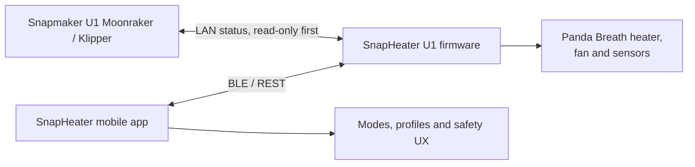

# SnapHeater U1

## September 2026 development update

Matching Android and firmware sources now include the connection wizard,
Panda Wi-Fi provisioning, printer discovery, saved heater names, autonomous
execution after phone disconnection, all-mode virtual-door alerts, unified
BLE/REST commands, standalone tempering and configurable scheduled preheat.
See [current implementation and remaining work](docs/CURRENT_IMPLEMENTATION.md)
and [the Android/firmware contract](docs/APP_CONTROL_CONTRACT.md).
This is an experimental source update, not a hardware-qualified binary release.

[](LICENSE)
[](#build-target)
[](#current-stage)
[](https://buymeacoffee.com/damianborkh)

**SnapHeater firmware for original Panda Breath electronics with Snapmaker U1 workflows.**

SnapHeater U1 combines its existing Android, BLE, REST and Snapmaker U1 features
with a Panda Breath hardware layer derived from the MIT-licensed
[DragonBreath](https://github.com/plastikman/DragonBreath) project. This target
is the original Panda Breath V1.0/V1.0.1 electronics, not AirGuard 300.

> **Project revival credit:** SnapHeater U1 could be brought back as firmware for
> the original Panda Breath electronics thanks to the reverse-engineering,
> hardware investigation and public documentation by
> [`plastikman`, author and maintainer of DragonBreath](https://github.com/plastikman/DragonBreath).
> The recovered hardware map, fan/TRIAC behavior, NTC conversion and thermal
> findings provided the essential foundation for this revival.

> Current status: **DragonBreath hardware recovery**. The recovered hardware map
> is present. Experimental tester defaults enable fan and heater support;
> boot does not start heating. Normal mode activation needs no separate unlock.
> Use the [functional tester build instructions](docs/TESTER_BUILD.md), not an older cached configuration.
> The pinned, repository-wide comparison and remaining blockers are documented in
> [public safety status](docs/SAFETY_STATUS.md).

---

## Support

SnapHeater U1 is released under the MIT License and is developed as an open project.
If this work helps you or you want to support continued firmware, documentation and hardware-validation work, you can support the project here:

[Buy Me a Coffee](https://buymeacoffee.com/damianborkh)


---

## Why this project exists

A chamber heater becomes much more useful when it understands the printer. SnapHeater U1 is designed to coordinate chamber temperature with printer state, selected material, print progress, pause/finish behavior and user preferences.

The project is not intended to take over the printer. It focuses on safe chamber climate cooperation.

---

## Key features

See [PROJECT_HIGHLIGHTS.md](PROJECT_HIGHLIGHTS.md) for the full feature list.

Main highlights:

- **Snapmaker U1 / Moonraker integration**
- **U1 Symbiont Mode** for safe chamber-related cooperation
- **BLE advanced control** for Android/mobile workflows
- **Physical quick controls** with buttons and status LED/backlight support
- **Preheat / Hold**, **Heat Soak**, **Chamber Stability Lock**
- **Tempering** with user-selected duration
- **Post-Print Conditioning** and **Pickup Mode**
- **Material-aware profiles**, mismatch warning and PLA protection
- **Anti-Warp**, **Large Print Protection**, **Safe Overnight Mode**
- **Virtual Door / Open Lid Detection** through temperature-drop analysis
- **Heater Health Test**, **Airflow Detection**, **Filter Life Counter**
- **Energy Estimate**, **Temperature History**, **Incident Report**
- **First Setup Wizard**, **Output Safety Latch**, **Safety Score**
- **Local-only operation**, event codes and notification levels
- **Offline regression simulations**, separate from physical control

---

## System architecture


```mermaid
flowchart LR
    App[SnapHeater mobile app] <-->|BLE / REST| FW[SnapHeater U1 firmware]
    FW --> Heater[Panda Breath heater,
fan and sensors]
    U1[Snapmaker U1 Moonraker / Klipper] <-->|LAN status, read-only first| FW
    App --> Workflows[Modes, profiles and safety UX]
```

Additional diagrams: [docs/SYSTEM_DIAGRAMS.md](docs/SYSTEM_DIAGRAMS.md)

---

## Control model

SnapHeater U1 uses two user-control layers:

### SnapHeater on Panda Breath hardware

The active path replaces the device firmware while preserving the established
SnapHeater mobile and U1 integration surfaces. The low-level map and electrical
behavior follow DragonBreath: heater SSR GPIO18, held fan gate GPIO3,
zero-cross GPIO7, NTC ADC channels GPIO0/GPIO1 and Rref strap GPIO19. The
control path uses DragonBreath's PID constants and 10-second time-proportioning
window, 5-sample NTC averaging for control, instantaneous hard trips at 85 C
(chamber) and 105 C (PTC), and 33k/82k-specific PTC foldback.

### Physical quick controls

The DragonBreath-derived panel map provides these optional actions:

- **Power / GPIO9** — toggle work; long press can request safe fault clearing
- **Auto / GPIO8** — printer-aware chamber mode
- **On / GPIO10** — manual chamber hold
- **Dry / GPIO2** — filament drying mode
- **Auto/On/Dry LEDs / GPIO6/5/4** — mode and fault feedback

GPIO9/GPIO8/GPIO2 are strapping pins, so held-at-boot inputs are ignored until
released. The GPIO21 Power LED remains disabled by default because it shares
UART0 TX.

### BLE / Android advanced control

Advanced configuration and smart workflows:

- material profile selection,
- preheat target and hold time,
- heat soak and chamber readiness,
- tempering duration,
- drying modes,
- Symbiont Mode settings,
- safety validation,
- diagnostics, events and reports.

REST, BLE and the physical panel stay available at the same time, while a shared
session arbiter prevents conflicting writes. One channel owns an active heating
session, remote owners use a five-minute exact lease plus state revisions, OFF
works from every channel, and an explicit takeover performs a force-off before
ownership changes. Moonraker remains printer telemetry for AUTO rather than a
parallel settings writer.

---

## U1 Symbiont Mode

**U1 Symbiont Mode** is the biologically inspired cooperation model between SnapHeater U1 and Snapmaker U1.

In this mode SnapHeater U1 can:

- read printer state from Moonraker,
- adapt chamber behavior to material and print state,
- optionally cooperate with chamber-related ventilation behavior,
- keep printer-critical actions blocked by design.

Blocked by design:

- print cancel/pause commands,
- motion commands,
- extrusion commands,
- nozzle and bed temperature changes,
- other printer-critical functions.

The goal is chamber climate cooperation, not full printer control.

---

## Safety philosophy

The active project safety model is conservative:

- fan GPIO3 is a held HIGH/LOW gate, never PWM or phase-angle pulses,
- fan ON is accepted only at a validated zero-cross; OFF is immediate,
- the heater SSR cannot turn on until airflow is physically confirmed,
- a 105 C hard PTC cutoff and board-specific 33k/82k soft foldback,
- an Output Safety Latch that never arms automatically,
- sensor fault handling,
- session timeout,
- incident report/fault snapshot,
- first setup validation,
- guarded diagnostics and staged hardware bring-up.

> Physical validation on the exact device revision remains required. No raw
> force-ON path is part of the supported test flow.

## Hardware responsibility and liability

SnapHeater U1 is custom firmware for heater-related hardware. Flashing, wiring, modifying or operating Panda Breath-style hardware or DIY heater hardware can be dangerous if the device is connected, protected, configured or tested incorrectly.

By using this project, the user accepts full responsibility for their own hardware, wiring, component choices, safety protections, validation and operation. The project authors and contributors cannot verify individual devices, DIY builds, installation quality, user actions or local safety conditions, and disclaim liability for damage, malfunction, unsafe operation, incorrect wiring, missing protections, user error, component failure, fire, injury, data loss or other outcomes arising from use of this project.

See [docs/HARDWARE_LIABILITY_DISCLAIMER.md](docs/HARDWARE_LIABILITY_DISCLAIMER.md).

---

## DIY Reference Hardware

Builders who want to assemble compatible hardware instead of using Panda Breath-style hardware can start with [docs/diy_hardware/README.md](docs/diy_hardware/README.md).

The DIY reference path includes:

- [BOM](docs/diy_hardware/BOM.md)
- [sourcing examples](docs/diy_hardware/SOURCING_EXAMPLES.md)
- [wiring diagram](docs/diy_hardware/WIRING_DIAGRAM.md)
- [validation checklist](docs/diy_hardware/VALIDATION_CHECKLIST.md)

The DIY reference is intended around low-voltage DC hardware and still requires the same staged safety unlock process as any other heater build.

---

## Repository structure

```text
SnapHeater_U1/
├── README.md
├── PROJECT_HIGHLIGHTS.md
├── FEATURE_MATRIX.md
├── BUILD_AND_TEST_PLAN.md
├── CHANGELOG.md
├── docs/
│   └── SYSTEM_DIAGRAMS.md
├── examples/
├── main/
│   └── board_panda_breath.h
├── CMakeLists.txt
├── partitions.csv
└── sdkconfig.defaults
```

Useful starting points:

- [PROJECT_HIGHLIGHTS.md](PROJECT_HIGHLIGHTS.md) — public feature overview
- [FEATURE_MATRIX.md](FEATURE_MATRIX.md) — feature readiness and test status
- [BUILD_AND_TEST_PLAN.md](BUILD_AND_TEST_PLAN.md) — safe build and bring-up sequence
- [apps/android/SnapHeaterU1](apps/android/SnapHeaterU1) — Android companion app UI prototype
- [docs/diy_hardware/README.md](docs/diy_hardware/README.md) — DIY reference hardware BOM and wiring notes
- [docs/HARDWARE_BRINGUP_CHECKLIST.md](docs/HARDWARE_BRINGUP_CHECKLIST.md) — first physical hardware bring-up checklist
- [docs/panda_breath_fan_triac.md](docs/panda_breath_fan_triac.md) — DragonBreath-derived held-gate GPIO7/GPIO3 fan control
- [docs/SAFETY_UNLOCK_PROCEDURE.md](docs/SAFETY_UNLOCK_PROCEDURE.md) — staged criteria for unlocking probe and heater output features
- [docs/SAFETY_STATUS.md](docs/SAFETY_STATUS.md) — current safeguards, verification and release blockers
- [docs/SYSTEM_DIAGRAMS.md](docs/SYSTEM_DIAGRAMS.md) — Mermaid diagrams
- [main/board_panda_breath.h](main/board_panda_breath.h) — central board pin configuration

---

## Build target

Target platform:

```text
ESP32-C3
ESP-IDF
```

The active target is original Panda Breath ESP32-C3 hardware. The hardware map
is defined, while repository defaults keep physical power control disabled:

```text
CONFIG_SHU1_HEATER_GPIO=18
CONFIG_SHU1_FAN_GPIO=3
CONFIG_SHU1_ZERO_CROSS_GPIO=7
CONFIG_SHU1_RREF_STRAP_GPIO=19
CONFIG_SHU1_ENABLE_HEATER_OUTPUT=n
CONFIG_SHU1_ENABLE_FAN_TRIAC_CONTROL=n
```

Default safe build command:

```bash
idf.py set-target esp32c3
idf.py build
```

Current build baseline:

- target: `esp32c3`
- ESP-IDF: `v5.3.5`
- flash layout: Panda Breath-style `4MB` dual-OTA partition table
- default safety: mapped hardware, power outputs build-disabled and boot-disarmed

To compile the real held-gate fan path without compiling heater energization,
add `sdkconfig.panda-safe.defaults` to `SDKCONFIG_DEFAULTS`. This is a build and
bench-diagnostics profile, not permission to flash or energize mains hardware.

Do not flash until the original image is backed up and the staged hardware
checklist has been completed for the exact board revision.

> **Stock-preserving install rule:** the intended production installation is an
> app-only `.bin` uploaded through the stock Panda firmware updater. A plain
> `idf.py flash` writes the bootloader, partition table and OTA data too; use it
> only for deliberate recovery/development after making a full 4 MB backup. The
> SnapHeater now provides an authenticated app-only OTA endpoint that writes the
> inactive stock-layout slot, validates ESP image/project identity and retains
> bootloader rollback. This is still not a production release until its rollback
> and return-to-stock cycle passes the documented physical HIL qualification.

---

## Mobile apps

The Android companion app prototype lives in [apps/android/SnapHeaterU1](apps/android/SnapHeaterU1).

Current status:

- Jetpack Compose UI shell
- mock and BLE-backed app experiments
- SnapScreen-like status-first layout
- dashboard, modes, safety setup, diagnostics and settings views
- EN primary UI direction with PL and DE resources started
- active direction: SnapHeater BLE/REST integration with the recovered Panda hardware layer

The app controls SnapHeater firmware through its existing BLE and LAN REST
interfaces; firmware safety remains authoritative over physical outputs.

iOS is a planned target. The current iOS placeholder is documented in [apps/ios/SnapHeaterU1](apps/ios/SnapHeaterU1).

Android build setup notes are available in [apps/android/SnapHeaterU1/docs/BUILD_SETUP.md](apps/android/SnapHeaterU1/docs/BUILD_SETUP.md).

---


## License, attribution and project origin

### DragonBreath project revival acknowledgement

Special thanks and explicit project credit go to
[`plastikman`, author and maintainer of DragonBreath](https://github.com/plastikman/DragonBreath).
Their reverse-engineering and validation work on the original Panda Breath
electronics made the hardware-focused revival of SnapHeater U1 possible.

SnapHeater U1 retains its own project identity and U1-specific features, while
the Panda Breath hardware layer is being rebuilt from the published
DragonBreath findings and safety behavior. DragonBreath remains an independent
MIT-licensed upstream project, and its authorship is not transferred to
SnapHeater U1.

SnapHeater U1 is licensed under the **MIT License**.

Original project by **Damian Borkowski** (`@damianborkowski88`).

For license and attribution details, see:

- [LICENSE](LICENSE)
- [LICENSE_POLICY.md](LICENSE_POLICY.md)
- [AUTHORS.md](AUTHORS.md)
- [ACKNOWLEDGEMENTS.md](ACKNOWLEDGEMENTS.md)
- [NOTICE.md](NOTICE.md)
- [PROJECT_ORIGIN.md](PROJECT_ORIGIN.md)
- [BRANDING_AND_ATTRIBUTION.md](BRANDING_AND_ATTRIBUTION.md)

The project is intended as the original upstream SnapHeater U1 firmware framework for Snapmaker U1-focused chamber-heater development. Forks and derivative works are welcome under MIT, but should preserve copyright/license notices and clearly credit the original upstream project.


## Current stage

This repository currently contains a **feature-rich firmware skeleton**. It is intended as the base for:

1. safe firmware flashing with runtime heater safety active,
2. GPIO and sensor validation,
3. Moonraker/Snapmaker U1 integration tests,
4. BLE/mobile integration,
5. staged heater/fan bring-up.

It is not yet a fully validated production firmware.

For the first physical hardware session, follow [docs/HARDWARE_BRINGUP_CHECKLIST.md](docs/HARDWARE_BRINGUP_CHECKLIST.md).

---

## License

SnapHeater U1 is released under the **MIT License**.

See:

- [LICENSE](LICENSE) — full license text
- [LICENSE_POLICY.md](LICENSE_POLICY.md) — project licensing scope and rationale
- [THIRD_PARTY_NOTICES.md](THIRD_PARTY_NOTICES.md) — external ecosystem and dependency notes
- [SECURITY.md](SECURITY.md) — safety and security policy


## Hardware flash layout

SnapHeater U1 now uses a Panda Breath-compatible 4 MB flash layout with two large OTA app slots, SPIFFS, coredump and NVS. See [`docs/original_flash_layout.md`](docs/original_flash_layout.md).


## Development safety and original flash notes

Before flashing hardware, make a full backup of the original device flash. See [`docs/FLASH_BACKUP_RESTORE.md`](docs/FLASH_BACKUP_RESTORE.md). Clean-room binary findings are summarized in [`docs/BINARY_FINDINGS_NOTES.md`](docs/BINARY_FINDINGS_NOTES.md).

A generic 4 MB original-firmware restoration image is available at [`firmware/original/generic.bin`](firmware/original/generic.bin). Restore instructions are in [`docs/BACK_TO_ORIGINAL_FW.md`](docs/BACK_TO_ORIGINAL_FW.md).

Do not upload that 4 MB full-flash backup to `/update`: OTA accepts only an
application image whose embedded project identity is `SnapHeater_U1`,
`dragonbreath` or stock `panda_breath`. See [docs/api.md](docs/api.md) and the
adapted [HIL procedure](docs/HIL.md).
