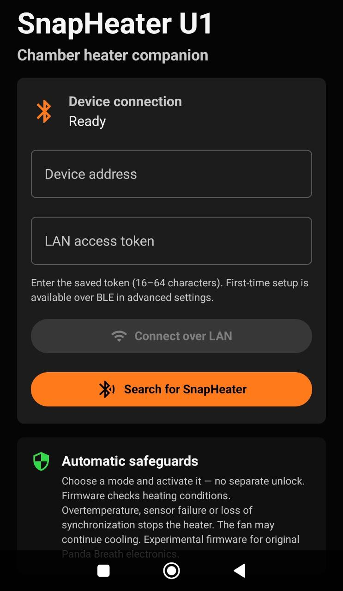
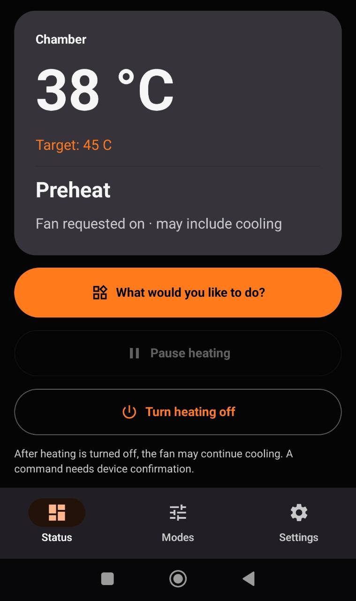
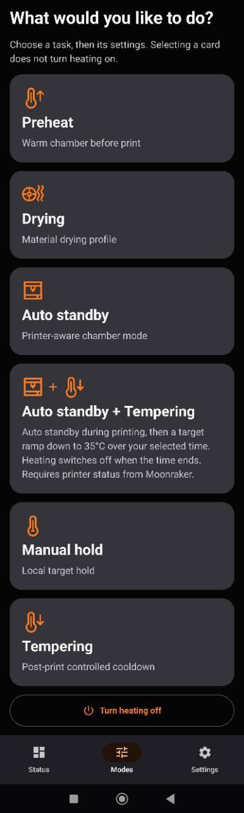
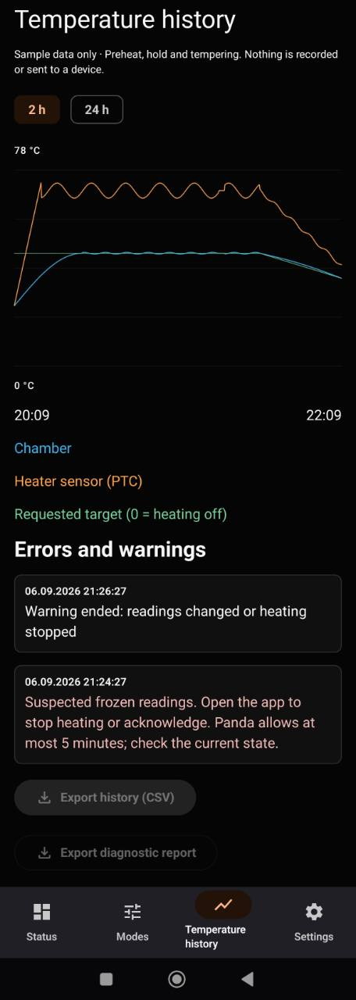

# SnapHeater U1 — Android gallery

<strong>Your chamber heater. Connected to your print.</strong>

Screenshots supplied by the project author for the **0.9.9 development/testing
series**. Tap an image to see the original at full resolution.

**Presentation, not hardware-test evidence:** the dashboard shows illustrative
values; History is from the local `0.9.9-preview` build and uses synthetic data.
The public Android APK has no disconnected-device preview option. The older
dashboard and mode captures show three navigation tabs; the current app also
includes History, as shown in the fourth screenshot. The exact build code of
the earlier captures is not embedded in those images.

## 1. Connect your heater

BLE discovery and authenticated LAN connection, with the runtime-safeguard
notice visible. Address and token fields in this capture are empty.

## 2. See the chamber at a glance

Large chamber reading, requested target, active task and a prominent heating
stop action. The displayed 38 °C / 45 °C values are illustrative, not a reported
measurement from a qualified test. Pause is disabled in this older preview capture.

## 3. Choose a task, not a collection of sliders

Icon-led cards for preheat, drying, AUTO, AUTO + Tempering, manual hold and
standalone tempering. The AUTO + Tempering card combines the AUTO icon,
a plus sign and the tempering icon.

## 4. Follow the temperature story

Chamber, PTC and requested-target curves, 2 h / 24 h selection and timestamped
warning history. This capture explicitly labels its data as synthetic. Export
buttons are disabled in the local preview; real-device history supports export.

---

[Download the public testing release](https://github.com/AlphaStudioDE/SnapHeater-U1/releases/tag/v0.9.9)
· [Install guide](INSTALL_0.9.9.md) · [Testing risk notice](HARDWARE_LIABILITY_DISCLAIMER.md)
· [Back to the project](../README.md)
