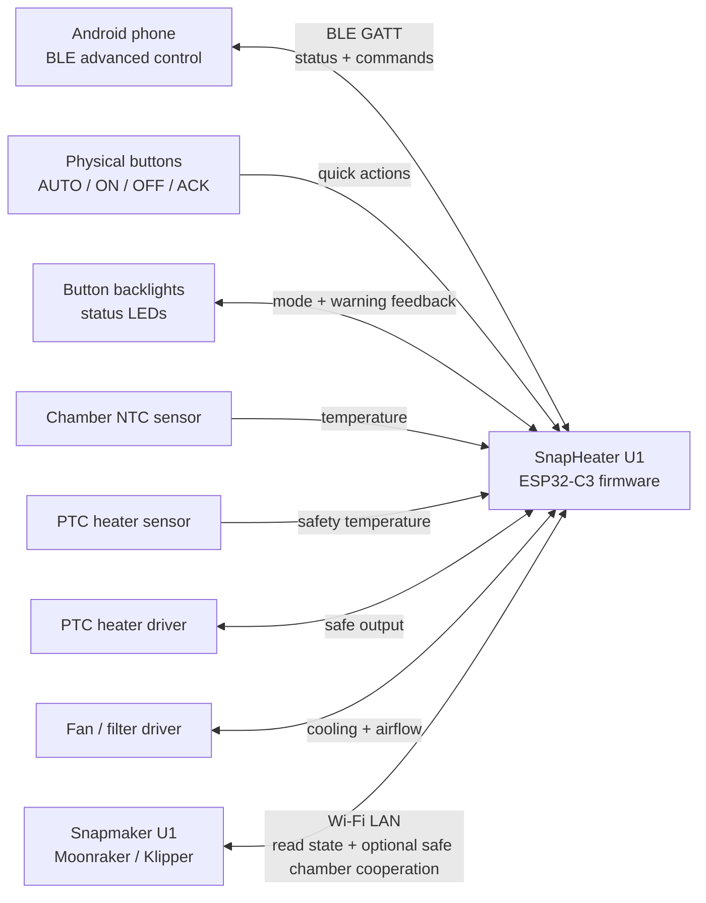
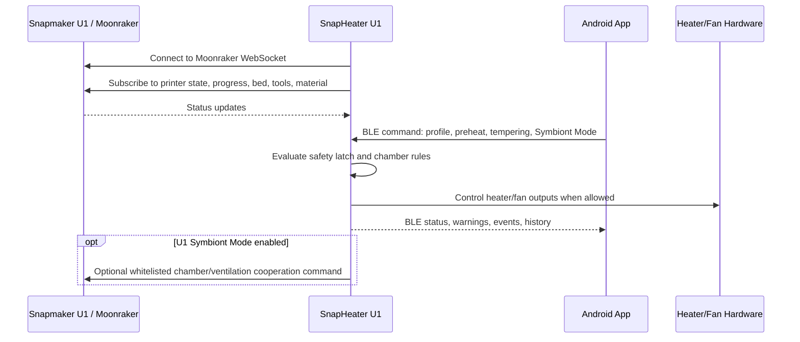
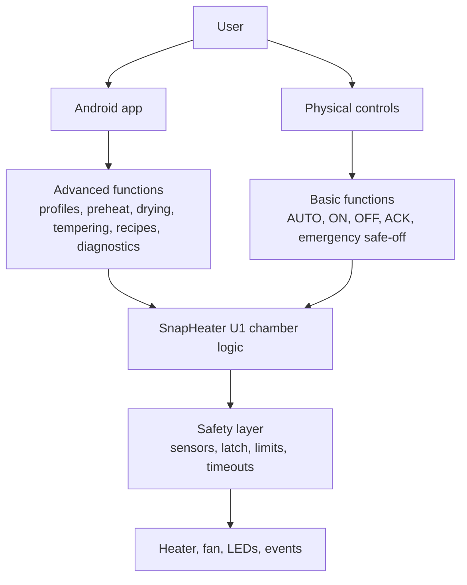
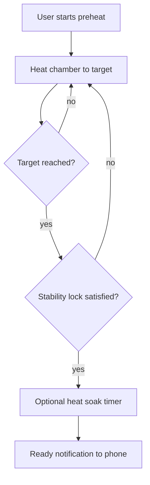
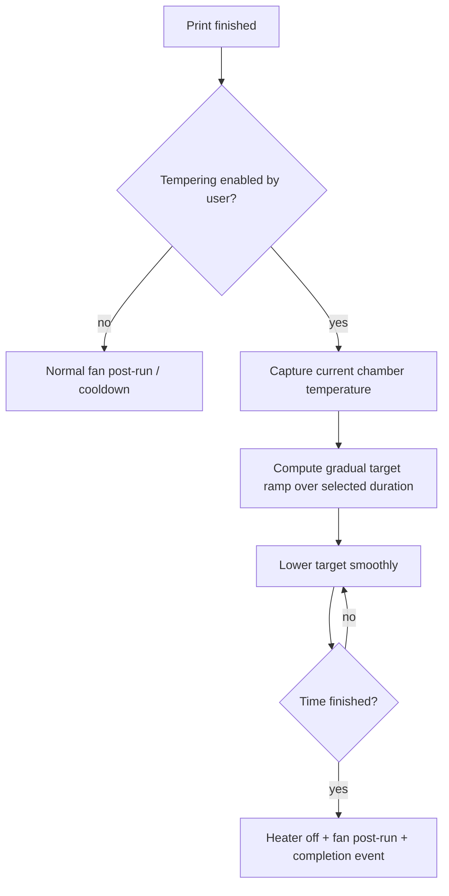
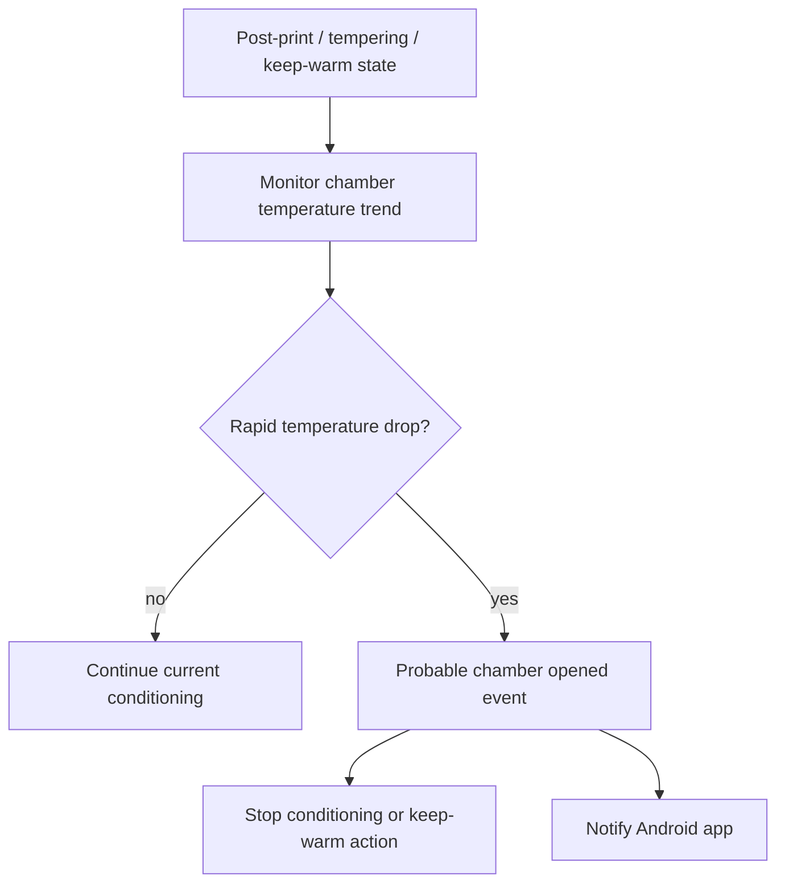
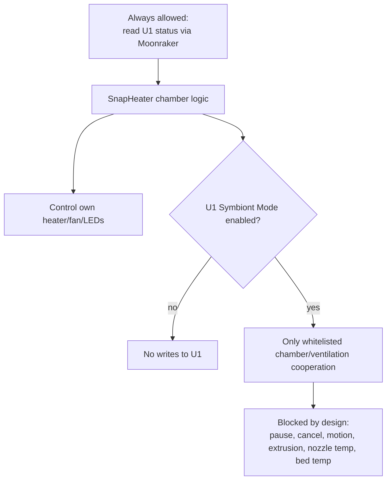
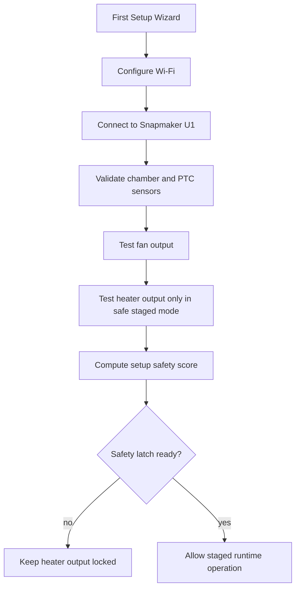

# SnapHeater U1 — System Diagrams

This document provides GitHub-rendered Mermaid diagrams for the SnapHeater U1 architecture, data flow, safety model and user control layers.

---

## 1. Overall architecture

---

## 2. Data flow between SnapHeater U1 and Snapmaker U1

---

## 3. Control layers

---

## 4. Preheat + heat soak workflow

---

## 5. Tempering workflow

---

## 6. Virtual door / top-cover detection

---

## 7. U1 Symbiont Mode safety boundary

---

## 8. First setup and safety validation

