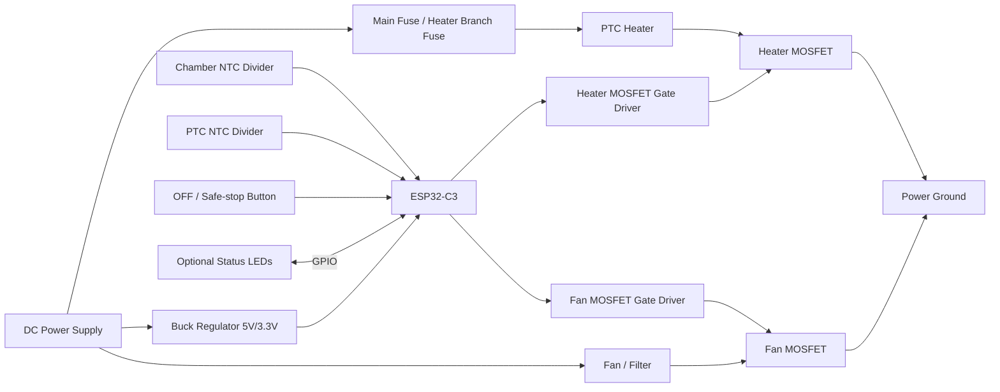

# DIY Reference Wiring Diagram

This diagram shows logical connections for a low-voltage DC reference build.

It is not a PCB layout and does not replace electrical review.

## High-Level Diagram



## Grounding

- ESP32-C3 ground and power-driver ground must share a reference.
- Keep heater current wiring physically separate from ADC sensor wiring.
- Route NTC wires away from heater and fan power wiring where possible.
- Use secure connectors for all moving or heated areas.

## GPIO Mapping Example

The default firmware values are Panda Breath-oriented. A DIY board can use different pins.

Example only:

```txt
CONFIG_SHU1_HEATER_GPIO=<your heater driver GPIO>
CONFIG_SHU1_FAN_GPIO=<your fan driver GPIO>
CONFIG_SHU1_CHAMBER_ADC_CH=<your chamber ADC channel>
CONFIG_SHU1_PTC_ADC_CH=<your PTC ADC channel>
CONFIG_SHU1_BUTTON_OFF_GPIO=<your OFF button GPIO or -1>
CONFIG_SHU1_ENABLE_HEATER_OUTPUT=n
CONFIG_SHU1_ENABLE_GPIO_PROBE=n
```

Do not copy example GPIOs blindly. Use pins available on the actual ESP32-C3 board.

## Heater Driver Requirements

The heater output GPIO should drive a MOSFET gate circuit or driver input.

Recommended driver behavior:

- output defaults OFF during reset,
- gate pulldown keeps heater OFF,
- MOSFET is logic-level at ESP32-C3 GPIO voltage,
- MOSFET and wiring are rated for heater current,
- fuse protects the heater branch,
- independent thermal cutoff is in the heater path.

## Fan Driver Requirements

The fan should be tested before the heater.

Recommended driver behavior:

- fan can run without heater,
- fan output defaults OFF during reset unless deliberately designed otherwise,
- driver is protected against inductive transients,
- fan airflow direction is confirmed before heater testing.

## Sensor Wiring

Each NTC should be wired as a voltage divider to an ADC-capable input.

Validate before output tests:

- room-temperature reading is plausible,
- warmed sensor changes in the expected direction,
- open or short wiring is detected as invalid,
- both chamber and PTC sensors are stable enough for safety logic.

## Physical Safe-Off

A physical OFF/safe-stop button should be available.

It should be tested before heater output is enabled. Physical controls must not bypass firmware safety checks, but they should provide a fast way to request safe-off.
